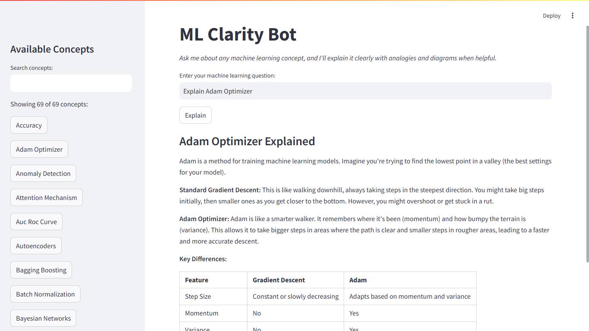
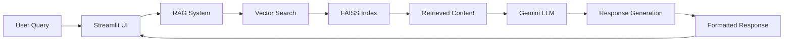

# ML Clarity Bot

ML Clarity Bot is an interactive Streamlit application that explains machine learning concepts clearly using simple language, relatable analogies, and visual diagrams. The application leverages Google's Gemini AI model through a Retrieval Augmented Generation (RAG) architecture to provide accurate and accessible explanations.



## Features

- **Concept-Based Explanations**: Pre-loaded with 50+ machine learning concepts
- **Natural Language Interface**: Ask questions in plain English about any ML concept
- **Interactive Concept Browser**: Browse and search through available concepts
- **Clear Explanations**: Responses include:
  - Concise definitions
  - Detailed explanations with examples
  - Real-world analogies for better understanding
  - Visual diagrams (using Mermaid) when appropriate

## System Architecture

ML Clarity Bot uses a Retrieval Augmented Generation (RAG) architecture:

1. **Knowledge Base**: Contains detailed explanations of ML concepts
2. **Vector Storage**: FAISS vector database for efficient semantic search
3. **Embeddings**: Google Generative AI embeddings to convert text to vectors
4. **LLM Integration**: Gemini 1.5 Flash model for generating clear explanations
5. **Streamlit UI**: Interactive web interface

The following diagram illustrates the system flow:



## Installation

### Prerequisites

- Python 3.9+
- Google Gemini API key
- Git (for cloning the repository)
- 2GB+ RAM (recommended for vector operations)

### Setup Steps

1. **Clone the repository**:
   ```bash
   git clone https://github.com/AriachAmine/MLClarityBot.git
   cd MLClarityBot
   ```

2. **Create a virtual environment** (recommended):
   ```bash
   # For Windows
   python -m venv venv
   venv\Scripts\activate

   # For macOS/Linux
   python3 -m venv venv
   source venv/bin/activate
   ```

3. **Install dependencies**:
   ```bash
   pip install -r requirements.txt
   ```

4. **Set up your API key**:
   - Create a `.env` file in the project root directory
   - Add your Gemini API key: `GEMINI_API_KEY=your_api_key_here`
   - You can get a Gemini API key from [Google AI Studio](https://makersuite.google.com/app/apikey)

5. **Generate the knowledge base**:
   ```bash
   python generate_kb.py
   ```
   This process may take 5-15 minutes depending on your internet connection and API rate limits.

## Usage

### Starting the Application

1. **Launch the Streamlit application**:
   ```bash
   streamlit run app.py
   ```

2. **Access the web interface**:
   - Open your browser and go to `http://localhost:8501`

### Interacting with ML Clarity Bot

The application offers multiple ways to get explanations:

1. **Direct Questions**:
   - Type a question in the input field (e.g., "What is overfitting?")
   - Click "Explain" to get a detailed response

2. **Concept Browser**:
   - Use the sidebar to browse all available ML concepts
   - Click on any concept to automatically generate an explanation

3. **Search Functionality**:
   - Use the search box in the sidebar to filter concepts
   - Great for finding specific topics quickly

### Understanding Responses

Each explanation typically includes:

- A clear definition of the concept
- A detailed explanation with technical details
- A real-world analogy to help understanding
- Visual diagrams when appropriate (automatically generated)

## Project Structure

```
MLClarityBot/
├── app.py                  # Main Streamlit application
├── chatbot.py              # RAG chain and LLM integration
├── rag_core.py             # Vector store and embedding functions
├── generate_kb.py          # Knowledge base generation script
├── knowledge_base/         # Directory containing ML concept explanations
├── faiss_index/            # FAISS vector database files
├── requirements.txt        # Python dependencies
├── .env                    # Environment variables (API keys)
└── README.md               # Project documentation
```

### Core Components

- **`app.py`**: The Streamlit application that handles the user interface and interactions
- **`chatbot.py`**: Manages the Gemini model integration and RAG chain
- **`rag_core.py`**: Handles document processing, embeddings, and vector search
- **`generate_kb.py`**: Contains the list of ML concepts and generates explanations

## How It Works

1.  **Initialization**:
    *   The application loads the FAISS vector database.
    *   Initializes the Gemini language model.
    *   Sets up the RAG components.

2.  **User Interaction**:
    *   User asks a question or selects a concept.
    *   The application processes the query.

3.  **RAG Process**:
    *   The query is converted to an embedding vector.
    *   The vector is used to search the FAISS index for relevant documents.
    *   Most relevant content is retrieved from the knowledge base.
    *   This context is sent along with the original question to the Gemini model.

4.  **Response Generation**:
    *   Gemini generates a comprehensive response based on the provided context and its internal knowledge.
    *   The application formats the response using Markdown.
    *   Mermaid diagrams are rendered if included in the response.

5.  **Display**:
    *   The formatted response is displayed to the user in the Streamlit interface.
    *   Diagrams are rendered interactively by Streamlit.

## Extending the Knowledge Base

To add new ML concepts to the knowledge base:

1.  Edit the `ML_CONCEPTS` list in `generate_kb.py` to add your new concepts:
    ```python
    ML_CONCEPTS = [
        # Existing concepts
        "Your New Concept 1",
        "Your New Concept 2",
    ]
    ```

2.  Run the knowledge base generation script again:
    ```bash
    python generate_kb.py
    ```

3.  Restart the Streamlit application to see your new concepts available in the sidebar.

## Performance Optimization

For improved performance:

-   **Vector Store Initialization**: The first run after generating the knowledge base might be slightly slower as the vector store initializes completely. Subsequent runs should be faster.
-   **Memory Usage**: If you encounter memory issues, especially with a very large knowledge base:
    -   Consider reducing `chunk_size` in `rag_core.py` (default is often around 500-1000 characters). Smaller chunks require less memory per operation but might slightly impact context quality.
    -   If using different embedding models, ensure you are using one suitable for your available memory.
-   **Response Time**: The response time depends on the LLM. Lowering the `temperature` setting (if configurable in `chatbot.py` or `app.py`) can sometimes lead to faster, more deterministic responses, although potentially less creative ones.

## Troubleshooting

### Common Issues

-   **API Key Errors**: Ensure your `GEMINI_API_KEY` is correctly set in the `.env` file located in the project root. Verify the key is valid and has the necessary permissions.
-   **Knowledge Base Issues**: If concepts are missing or explanations seem incomplete after running `generate_kb.py`, check the script's output for errors. Ensure the script completed successfully. API rate limits might sometimes interrupt the generation.
-   **FAISS Index Problems**: If search functionality behaves unexpectedly, the index might be corrupted or outdated. Delete the `faiss_index/` directory and run `streamlit run app.py` again. The application should automatically attempt to rebuild it if `generate_kb.py` has successfully created the `knowledge_base`. If rebuilding fails, run `python generate_kb.py` first.
-   **Diagram Rendering Issues**: Check that the Mermaid syntax generated by the LLM or included in your knowledge base is valid. You can test Mermaid syntax online using the Mermaid Live Editor.

### Error Messages

-   **"Failed to initialize the system" / API Key Errors**: Usually indicates a problem with the `.env` file or the API key itself. Double-check the key and file placement.
-   **"No matching concepts found" / Poor Search Results**: The search term might be too ambiguous, or the concept might not be well-represented in the knowledge base chunks. Try rephrasing or extending the knowledge base.
-   **"I don't have enough information" / Generic LLM Response**: This can happen if the RAG system fails to retrieve relevant context, or the question falls outside the scope of the generated knowledge base. Ensure `generate_kb.py` ran correctly and covered the topic.

## Deployment

### Local Deployment

The application is ready for local deployment using the standard Streamlit command:
```bash
streamlit run app.py
```

### Cloud Deployment

**Streamlit Cloud:**

1.  Push your code (including `requirements.txt` but **excluding** `.env` and potentially large `faiss_index` or `knowledge_base` directories if generated dynamically) to a GitHub repository.
2.  Go to [Streamlit Community Cloud](https://share.streamlit.io/).
3.  Click "New app", connect your GitHub account, and select the repository.
4.  Configure the main file path (`app.py`).
5.  Under "Advanced settings...", add your `GEMINI_API_KEY` as a secret.
6.  Deploy! You might need a setup script or modify `app.py` to run `generate_kb.py` on the first boot or provide pre-built knowledge base/index files.

**Other Cloud Platforms (Heroku, AWS, GCP, Azure):**

-   **Heroku**: Add a `Procfile` with the content: `web: streamlit run app.py`. Use Heroku environment variables for the API key.
-   **AWS/GCP/Azure**: Containerizing with Docker is recommended. Create a `Dockerfile` based on a Python image, copy your project files, install requirements, and set the `CMD` or `ENTRYPOINT` to run Streamlit. Configure environment variables on the cloud platform.

*Note*: Be mindful of storage and memory requirements when deploying, especially for the FAISS index and knowledge base. Consider strategies like pre-building these artifacts or using cloud-based vector databases.

## Future Enhancements

Potential improvements for the project:

-   **User Feedback**: Add thumbs up/down buttons for explanations to collect feedback.
-   **Chat History**: Implement a session-based history to track previous queries and responses.
-   **Export Explanations**: Add functionality to export explanations (e.g., to PDF, Markdown).
-   **Concept Comparison**: Create a view to compare explanations of two related concepts side-by-side.
-   **Multi-Language Support**: Adapt the prompts and potentially use translation services for multi-language explanations.
-   **Advanced RAG**: Experiment with different retrieval strategies (e.g., HyDE, multi-query retriever).

## Security Considerations

-   **API Key Security**: **Never** commit your `.env` file or hardcode your API key directly into the source code, especially if the repository is public. Use environment variables or secret management systems.
-   **Knowledge Base Content**: The knowledge base content is generated using the Gemini API based on concept names. Review the generated content (`knowledge_base/` files) for accuracy and appropriateness if necessary.
-   **User Data Privacy**: The current application structure does not inherently store user queries or personal information persistently. Ensure any modifications (like chat history) handle data privacy appropriately.

## License

This project is licensed under the MIT License - see the `LICENSE` file for details (if one exists, otherwise state the license clearly).

## Acknowledgments

-   **Google Generative AI (Gemini)** for providing the powerful language model.
-   **Streamlit** for the easy-to-use web application framework.
-   **LangChain** for the robust RAG implementation components.
-   **FAISS (Facebook AI Similarity Search)** for the efficient vector similarity search library.
-   All contributors to the open-source libraries and tools used in this project.